# 🍔 Food Delivery Website

A full-stack Food Delivery Website designed to connect users with restaurants, enabling fast and reliable food ordering with real-time data handling and role-based access.

## 📌 Features

- 🔐 **User Authentication** with role selection (Customer / Restaurant)
- 📦 **Menu Management** for restaurants
- 🛒 **Add to Cart** and place orders (Customers)
- 🧾 **Order Management** system for restaurants
- 📊 **Dashboard** for different user types
- 📂 **RESTful APIs** for data communication
- 🗂️ **MongoDB Atlas** integration for cloud database

## 🛠️ Tech Stack

| Technology | Role |
|------------|------|
| Node.js    | Backend runtime |
| Express.js | Server framework |
| MongoDB    | NoSQL Database |
| Mongoose   | ODM for MongoDB |
| HTML/CSS/JS or React | Frontend *(depends on implementation)* |
| JWT / Session | Authentication |
| Git & GitHub | Version control |
| AWS | Hosting & Web App Deployment |

## 📁 Project Structure

### project-root/
### │
### ├── controllers/ # Route logic
### ├── models/ # Mongoose schemas
### ├── routes/ # API endpoints
### ├── views/ # HTML files or frontend framework
### ├── public/ # Static assets
### ├── .env # Environment variables
### ├── server.js # Entry point
### └── README.md # Project info


## 🧑‍💻 Getting Started

### Prerequisites
- Node.js
- MongoDB Atlas or local instance

### Installation
```bash
git clone https://github.com/jyoti1900/Food-Delivery-Website.git
cd Food-Delivery-Website
npm install
```
## 📸 Screenshots
## User Section
### Home Page


### Login Page
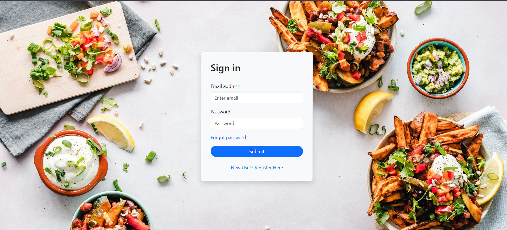

### Signup Page
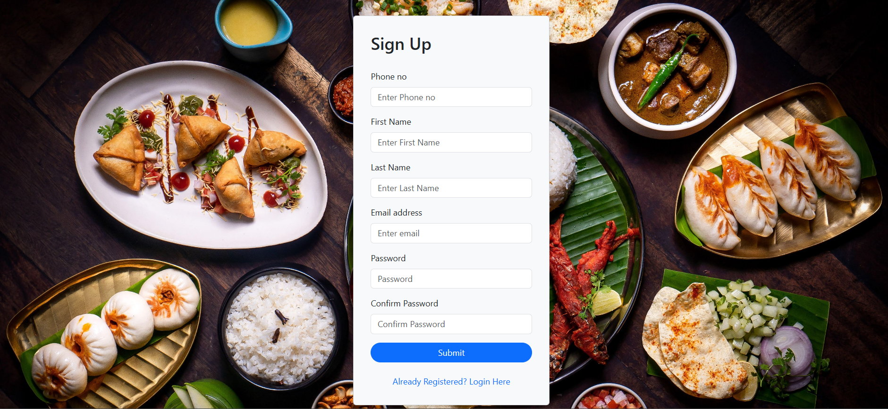

### Add to Card Page
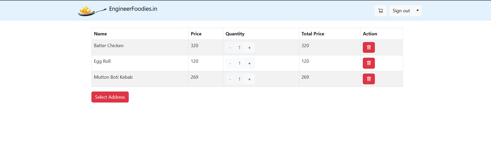

### Address Details Page
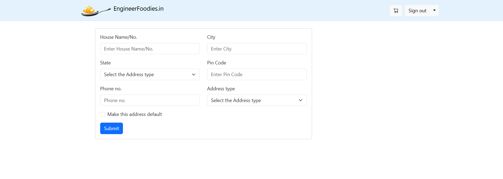

### Order Dashboard Page
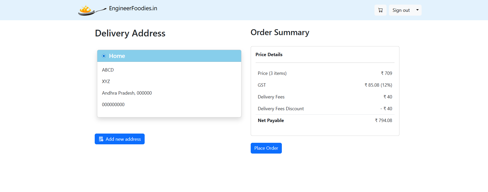

### My Order Page
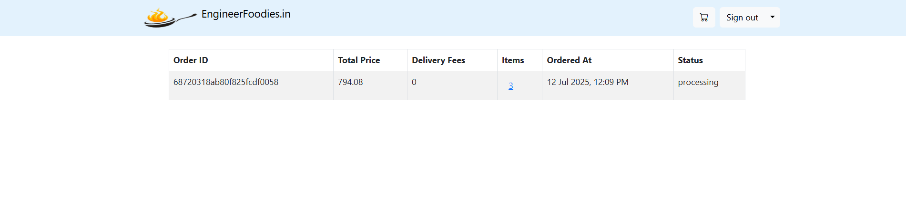

## Admin Section
### Admin DashBoard Page
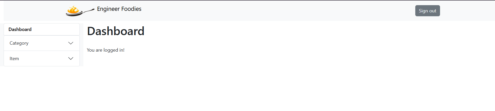

### Category Add Page
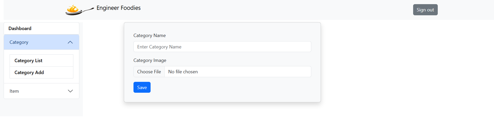

### Category List Page
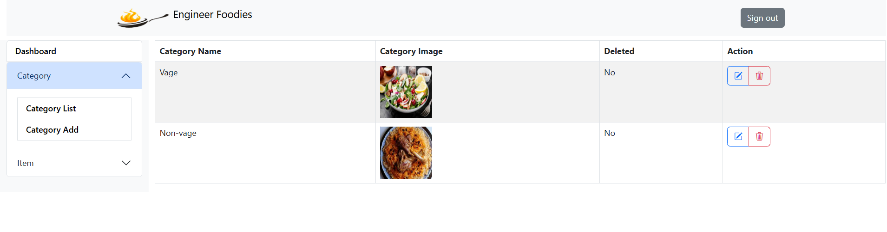

### Item Add Page
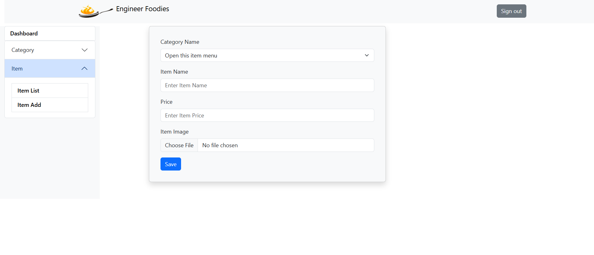

### Item List Page
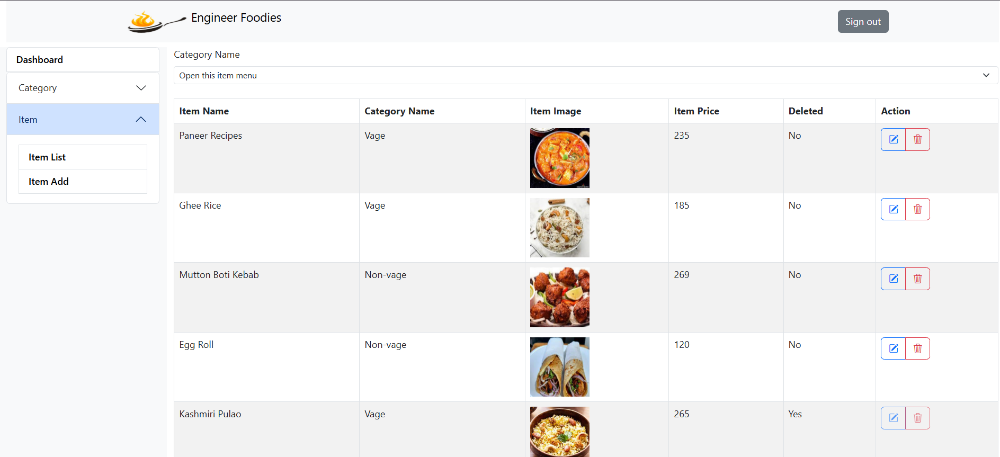

## Configuration
Create a .env file in the root directory:
```.env
PORT=3000
MONGO_URI=your-mongodb-connection-string
JWT_SECRET=your-secret-key
```

## Run Locally
```bash
cd Food-Delivery-Website
cd fdp-backend-node
npm start
cd fdp-frontend-react
npm start
```
Then visit: http://localhost:3000

## 🤝 Contributing
Pull requests are welcome. For major changes, open an issue first to discuss what you would like to change.
